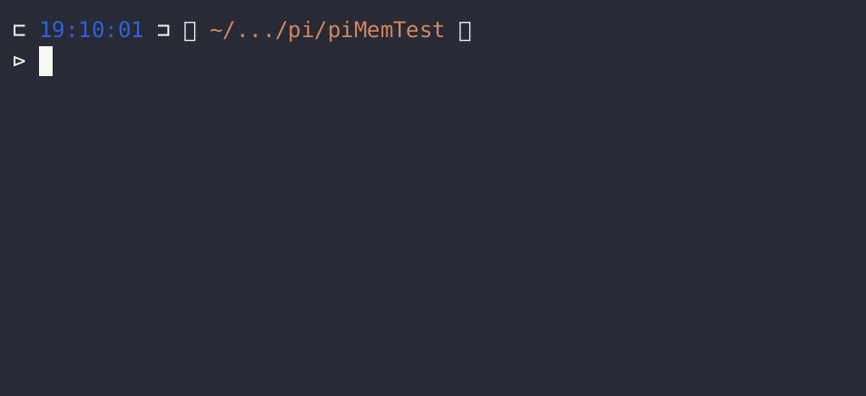

### Pi MemTest 

A bash script to help memorize the digits of Pi.

`piMemTest.sh -h`:

```
piMemTest.sh [<no. of decimals>] [<start/offset>]

  q or Ctrl+d := quit
  i           := info
  h           := this help menu
  Ctrl+l      := clear
```

### Known Issues:

Currently only runs on Debian derivatives.

It uses a program called `pi` to generate the digits / string;

```bash
apt-get install pi
```

### Example:


